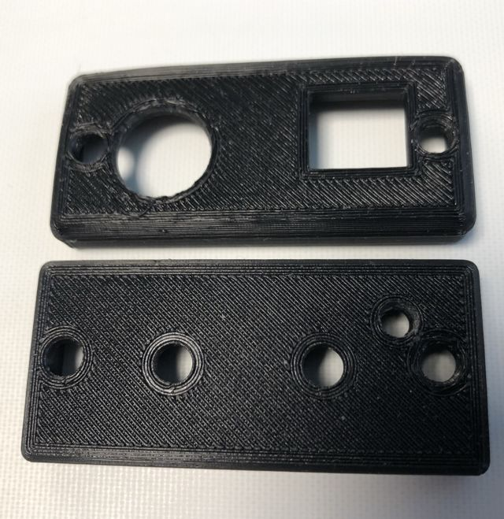
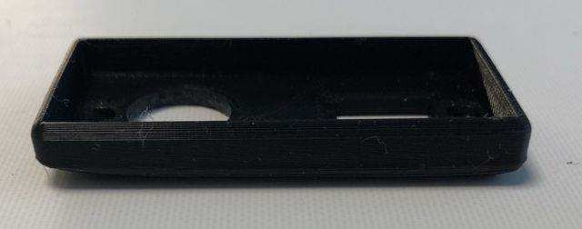
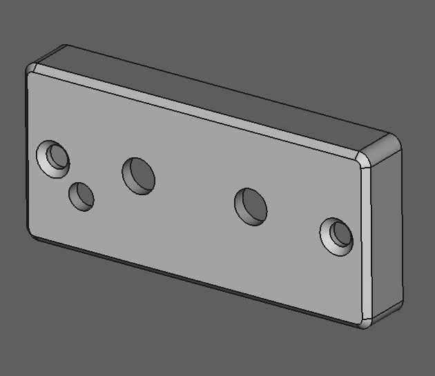
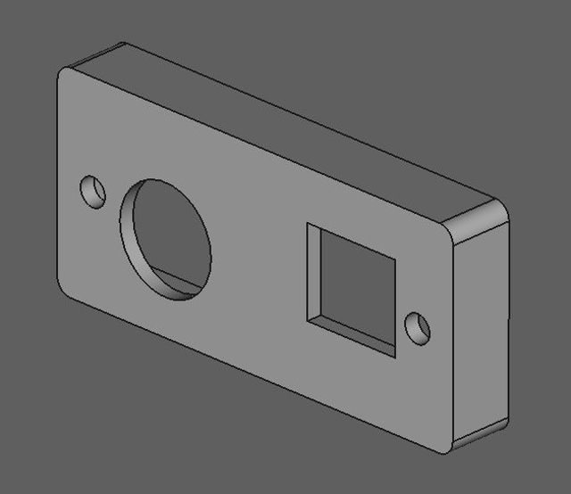

### BattLab Two

Another user interface for the BattLab One and some extras.

#### Introduction

The BattLab one is a nice device. Though its user interface is unusable under Linux when you could make it run at all after solving several import errors.
Also the 3d printed front and back parts seem to come from a cheap 3d printer with ugly filament. Nothing you would expect from a commercial product.

This project aims at making the user interface better and also offers FreeCAD drawings and STLs of the front and back part so yo can print it yourself.
The original repository has a case as STL available...but no STLs for the covers used in the commercial version.

